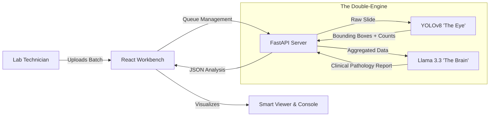

# MicroSmart PF


**The Premier Autonomous Agent for *P. falciparum* Diagnostics.**

MicroSmart PF is a high-performance diagnostic interface that bridges **Computer Vision** and **Clinical Reasoning**. It automates the detection of Malaria parasites in thin blood smears and generates WHO-compliant pathology reports in real-time.

Designed as a professional "Cockpit" for lab technicians and pathologists, it prioritizes speed, accuracy, and dark-mode ergonomics.

---

## 🌌 The MicroSmart Ecosystem

MicroSmart PF is the specialized malaria node of the larger **MicroSmart Project**. We are building a constellation of autonomous agents for hematology and cytology.

- **MicroSmart PF**: *P. falciparum* Malaria (Active)
- **MicroSmart Heme**: Hematology & CBC Analysis (In Development)
- **MicroSmart Cyto**: Cervical Cancer Screening (R&D)

[🌐 Explore the Parent Project](https://microsmartpf.xyz)

---

## 🚀 Key Features

### 🔬 The "Double-Engine" Architecture
- **The Eye (Vision Agent)**: Powered by **YOLOv8**. Scans slides at ~40ms/frame to detect Trophozoites, Gametocytes, and WBCs with pixel-perfect bounding boxes.
- **The Brain (Reasoning Agent)**: Powered by **Llama 3.3 (via Cerebras)**. Interprets raw cellular counts, calculates parasitemia levels, and acts as a virtual pathologist to write the final report.

### 🖥️ Interface (Frontend)
- **Professional Workbench**: A collapsible, 3-pane dashboard designed for high-throughput screening.
- **Batch Processing**: Queue multiple slides and process them sequentially without blocking the UI.
- **Smart Viewer**: High-fidelity deep zoom with **AI/RAW toggles** (Spacebar shortcut).
- **Filmstrip Navigation**: Rapidly switch between patient samples using Arrow Keys.
- **Zero-Latency UX**: Local-first state management with optimized React rendering.

---

## 🛠️ Tech Stack

**Frontend**
[](https://reactjs.org) [](https://vitejs.dev) [](https://tailwindcss.com)

**Backend**
[](https://fastapi.tiangolo.com) [](https://github.com/ultralytics/ultralytics) [](https://www.cerebras.net)

---

## ⚡ Getting Started

### 1️⃣ Clone the Repository
```bash
git clone [https://github.com/ujpm/microsmart_pf.git](https://github.com/ujpm/microsmart_pf.git)
cd microsmart_pf

```

### 2️⃣ Initialize Backend

The backend handles image processing and AI inference.

1. Create a virtual environment:
```bash
cd backend
python -m venv venv
source venv/bin/activate  # Windows: venv\Scripts\activate

```


2. Install dependencies:
```bash
pip install -r requirements.txt

```


3. **Configure API Keys:** Create a `.env` file in `backend/` and add your Cerebras key:
```env
CEREBRAS_API_KEY="csk-REPLACE_WITH_YOUR_KEY"

```


4. **Launch the Server:**
*Note: We bind to `0.0.0.0` to ensure access from cloud IDEs (Codespaces/Gitpod).*
```bash
uvicorn src.main:app --reload --host 0.0.0.0 --port 8000

```


### 3️⃣ Initialize The Body (Frontend)

The frontend is the interactive cockpit.

1. Open a new terminal.
2. Setup and run:
```bash
cd frontend
npm install
npm run dev

```


3. Access the workbench at: `http://localhost:5173`

---

## 🗺️ Architecture Diagram



---

## ⌨️ Shortcuts

| Key | Action |
| --- | --- |
| **Spacebar** | Toggle between AI Annotation and Raw Image |
| **Arrow Right** | Next Slide |
| **Arrow Left** | Previous Slide |

---

## 📜 Credits

**Architecture & Development**
Designed by **UJPM**

**License**
This project is open source under the MIT License. See `LICENSE` for details.

```

```